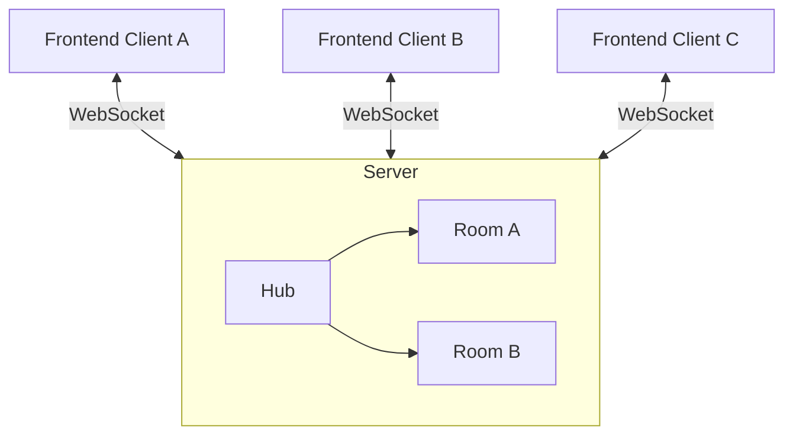

# Architecture

Backlog Royale is a real-time story pointing application built with a Go backend and a React frontend. It uses WebSockets for instantaneous state synchronization across all participants in a room.

## Overview

The application follows a simple client-server architecture where the server acts as a central hub for multiple "rooms". Each room is an isolated session where participants can vote on story points.



## Backend (Go)

The backend is located in the `/backend` directory. It uses the standard library's `net/http` package and `github.com/gorilla/websocket`.

### Key Components

- **Hub**: The central registry for all active rooms. It handles room creation and deletion. If a room becomes empty, the Hub removes it to save resources.
- **Room**: Manages the state of a specific story pointing session. It handles client registration, unregistration, and message broadcasting. Each room runs in its own goroutine.
- **Client**: Represents a single WebSocket connection. it handles reading from and writing to the socket.

### State Management

Room state is kept in-memory. There is no persistent database. If the server restarts, all active rooms and votes are lost. This is a design choice for simplicity and speed.

## Frontend (React)

The frontend is located in the `/frontend` directory. It is a modern React application built with Vite and TypeScript.

### Key Components

- **useBacklogRoyale Hook**: A custom hook that encapsulates WebSocket logic, including connection management, message parsing, and state updates.
- **Tailwind CSS 4**: Used for styling the application, providing a responsive and modern UI.
- **Lucide React**: Provides the icon set used throughout the application.

### State Synchronization

1.  A client joins a room by providing a `roomID` (via URL) and a `userName`.
2.  The `useBacklogRoyale` hook establishes a WebSocket connection to `/ws?room=ID&name=NAME`.
3.  The server sends the current `STATE` of the room immediately upon connection.
4.  Whenever a client performs an action (VOTE, REVEAL, RESET), the server updates the room state and broadcasts the new state to all clients in that room.

## Communication Protocol

Communication happens over WebSockets using JSON messages.

### Client to Server Actions

- **VOTE**: Cast or change a vote.
  ```json
  { "type": "VOTE", "name": "Alice", "vote": "5" }
  ```
- **REVEAL**: Show all votes to everyone.
  ```json
  { "type": "REVEAL", "name": "Alice" }
  ```
- **RESET**: Clear all votes and hide them for a new round.
  ```json
  { "type": "RESET", "name": "Alice" }
  ```

### Server to Client Messages

- **STATE**: Sent whenever the room state changes.
  ```json
  {
    "type": "STATE",
    "id": "room-uuid",
    "users": [
      { "name": "Alice", "hasVoted": true, "vote": "" },
      { "name": "Bob", "hasVoted": false, "vote": "" }
    ],
    "reveal": false
  }
  ```
  Note: The `vote` field for other users is empty unless `reveal` is `true`.
