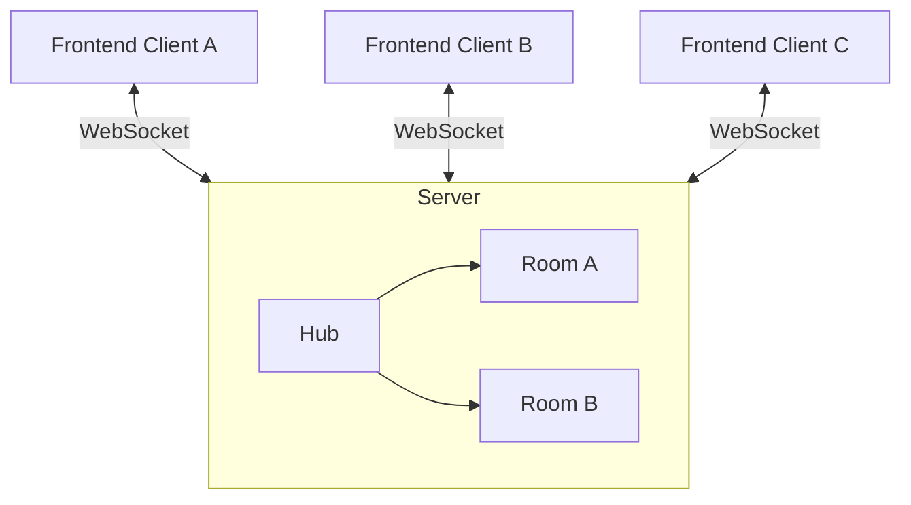

# Architecture

Backlog Royale is a real-time story pointing application built with a Go backend and a React frontend. It uses WebSockets for instantaneous state synchronization across all participants in a room.

## Overview

The application follows a simple client-server architecture where the server acts as a central hub for multiple "rooms". Each room is an isolated session where participants can vote on story points.


```mermaid
graph TD
    ClientA[Frontend Client A] <--> |WebSocket| Server[Go Backend]
    ClientB[Frontend Client B] <--> |WebSocket| Server
    ClientC[Frontend Client C] <--> |WebSocket| Server
    
    subgraph Server
        Hub[Hub]
        Room1[Room A]
        Room2[Room B]
        Hub --> Room1
        Hub --> Room2
    end
```

## Backend (Go)

The backend is located in the `/backend` directory. It uses the standard library's `net/http` package and `github.com/gorilla/websocket`.

### Key Components

- **Hub**: The central registry for all active rooms. It handles room creation and deletion. If a room becomes empty, the Hub removes it to save resources.
- **Room**: Manages the state of a specific story pointing session. It handles client registration, unregistration, and message broadcasting. Each room runs in its own goroutine.
- **Client**: Represents a single WebSocket connection. it handles reading from and writing to the socket.

### State Management

Room state is kept in-memory. There is no persistent database. If the server restarts, all active rooms and votes are lost. This is a design choice for simplicity and speed.

## Frontend (React)

The frontend is located in the `/frontend` directory. It is a modern React application built with Vite and TypeScript.

### Key Components

- **useBacklogRoyale Hook**: A custom hook that encapsulates WebSocket logic, including connection management, message parsing, and state updates.
- **useTheme Hook**: Manages the light/dark/system theme choice, persists it to `localStorage` (`backlog_royale_theme`), subscribes to OS `prefers-color-scheme` changes while in system mode, and toggles a `.dark` class on `<html>`. An inline script in `index.html` applies the class before paint to avoid a flash. The segmented light/dark/system toggle is a shared `ThemeToggle` component (`role="group"` + `aria-pressed` buttons) used in both the header and the join screen.
- **Semantic color tokens**: Tailwind v4 `@theme inline` in `src/index.css` maps 22 raw `:root`/`.dark` variables to utility classes (`bg-surface`, `text-content`, `border-line`, `accent`, `warn`, …). Dark mode is a single `.dark` variable block; components consume semantic utilities instead of hardcoded palette colors. `src/utils/theme.ts` separately encodes vote-band colors (emerald/blue/rose by point value) with `dark:` variants.
- **Tailwind CSS 4**: Used for styling the application, providing a responsive and modern UI.
- **Lucide React**: Provides the icon set used throughout the application.

### State Synchronization

1.  A client joins a room by providing a `roomID` (via URL) and a `userName`.
2.  The `useBacklogRoyale` hook establishes a WebSocket connection to `/ws?room=ID&name=NAME`.
3.  The server sends the current `STATE` of the room immediately upon connection.
4.  Whenever a client performs an action (VOTE, REVEAL, RESET), the server updates the room state and broadcasts the new state to all clients in that room.
5.  When switching rooms, the client sends its previous server-assigned ID as `prevId` in the WebSocket URL. The server uses a global client-ID-to-room index to find and evict the previous connection from whichever room it is still in, ensuring clean room transitions even if the old WebSocket has not fully closed yet. The eviction is performed by the owning Room's `Run` goroutine via its `evict` channel, preserving single-goroutine ownership of the `clients` map. `prevId` is sent exclusively on room switches (tracked in `useGameState` via a `prevIdToEvict` state field cleared once the new connection's WELCOME arrives); reconnects within the same room and additional tabs in the same room send no `prevId`, so coexisting tabs keep their vote/dealer state.

## Communication Protocol

Communication happens over WebSockets using JSON messages.

### Client to Server Actions

- **VOTE**: Cast or change a vote. Only valid for players.
  ```json
  { "type": "VOTE", "name": "Alice", "vote": "5" }
  ```
- **REVEAL**: Show all votes to everyone. Authorized for the dealer, or for any non-AFK player when no dealer is present in the room.
  ```json
  { "type": "REVEAL", "name": "Alice" }
  ```
- **RESET**: Clear all votes and hide them for a new round. Authorized for the dealer, or for any non-AFK player when no dealer is present in the room.
  ```json
  { "type": "RESET", "name": "Alice" }
  ```

### Server to Client Messages

- **STATE**: Sent whenever the room state changes.
  ```json
  {
    "type": "STATE",
    "id": "room-uuid",
    "users": [
      { "name": "Alice", "hasVoted": true, "vote": "" },
      { "name": "Bob", "hasVoted": false, "vote": "" }
    ],
    "reveal": false
  }
  ```
  Note: The `vote` field for other users is empty unless `reveal` is `true`.
