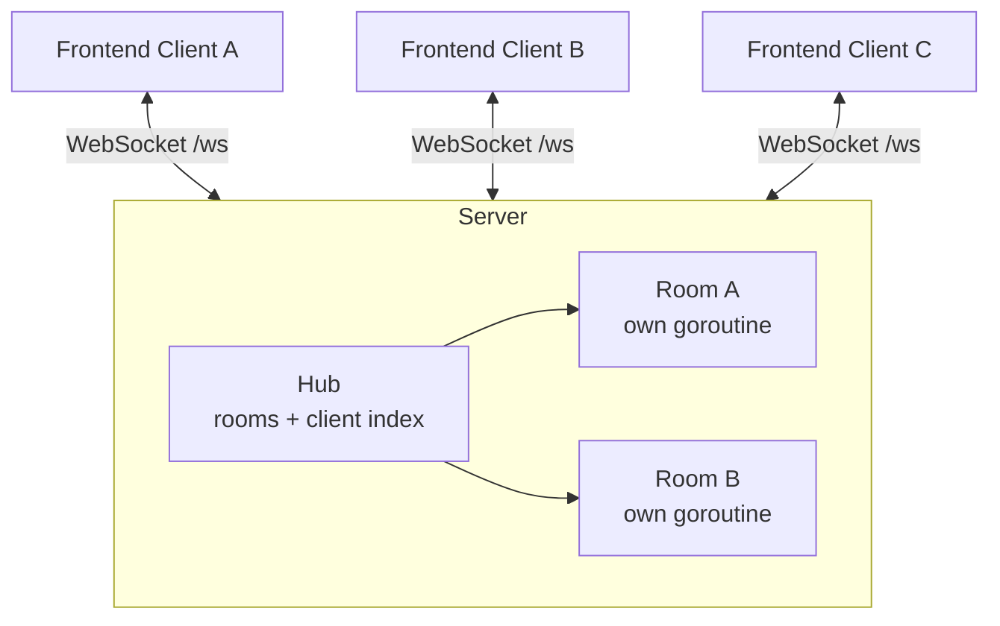

# Architecture

Backlog Royale is a real-time story pointing (Scrum Poker) application built with a Go backend and a React frontend. All state synchronization happens over WebSockets: the server is the single source of truth, and every client in a room receives a fresh state snapshot after every change.

## Design Goals

- **Simplicity first:** one Go process, in-memory state, no database, no external services, no queues.
- **Frictionless joining:** a room name and a display name are all that is required. No accounts, no auth.
- **Server-authoritative behavior:** identity, vote secrecy, and role permissions are enforced on the server, never by the client.
- **Real-time UX:** every action is reflected on every connected client within one broadcast.

## System Overview


```mermaid
graph TD
    ClientA[Frontend Client A] <--> |WebSocket /ws| Server[Go Backend]
    ClientB[Frontend Client B] <--> |WebSocket /ws| Server
    ClientC[Frontend Client C] <--> |WebSocket /ws| Server

    subgraph Server
        Hub[Hub<br/>rooms + client index]
        Room1[Room A<br/>own goroutine]
        Room2[Room B<br/>own goroutine]
        Hub --> Room1
        Hub --> Room2
    end
```

Each room is an isolated session with its own event-loop goroutine. Rooms that become empty are destroyed. There is no persistent storage: if the server restarts, all rooms and votes are lost — a deliberate trade-off for simplicity and speed (see [Design decisions](#design-decisions-and-trade-offs)).

## Backend (Go)

Located in `/backend`. Single module `github.com/j-stechmann/backlog-royale` with only two external dependencies: `github.com/gorilla/websocket` and `golang.org/x/time` (rate limiting). Logging is structured JSON via `log/slog`.

### Components

| File | Responsibility |
| :--- | :--- |
| `main.go` | Config from env, JSON logger, `/ws` route, security middleware (per-IP rate limit + security headers), `http.Server` timeouts. |
| `hub.go` | Registry of active rooms plus a global client-ID → room index used for eviction. |
| `room.go` | Room state, the per-room event loop, action handling, state broadcasting. |
| `client.go` | Per-connection read/write pumps, ping/pong keepalive, per-connection message rate limiter, `serveWs` upgrade handler. |
| `constants.go` | Role, action, and message-type string constants shared by both sides of the wire. |

### Concurrency Model

The core rule: **`Room.clients` is owned exclusively by that room's `Run` goroutine.** No other goroutine ever reads or mutates it. Everything that must affect room membership is routed through a channel and processed by the event loop:

- `register` — new client added (buffered, 16)
- `unregister` — graceful disconnect (buffered, 64)
- `evict` — forced removal (room switch), carries a client ID (buffered, 64)
- `broadcast` — client actions (VOTE, REVEAL, …), buffered 64

The event loop processes one case per iteration and then checks `len(r.clients) == 0`; an empty room removes itself from the Hub and its goroutine exits.

Additional synchronization:

- `Hub.rooms` is guarded by an `RWMutex`; the client-ID index has its own dedicated mutex (`Hub.idxMu`).
- Room game state (`participants`, `isRevealed`, `dealerID`) is guarded by `Room.mu`, held during `handleAction` and `broadcastStateLocked`.
- Every send into a room channel is **non-blocking with a `default` branch** so a busy or exiting room can never block a client pump. Each dropped send logs a warning (dropped unregisters and broadcasts were silent before v1.9.0, which made ghost clients hard to diagnose).

**Backpressure policy:** if a client's outbound channel (buffered, 256) is full when the room broadcasts state, the client is treated as dead — its send channel is closed, it is removed from the room, and it is disassociated from the index. A slow client is dropped rather than allowed to stall the room; the frontend's reconnect logic brings it back within ~3 seconds.

### Room Lifecycle

1. A WebSocket upgrade with a new `room` value calls `Hub.GetOrCreateRoom`, which creates the `Room`, stores it, and starts `room.Run()` in a new goroutine.
2. Clients register/unregister/are evicted through the channels above; each transition triggers a full state broadcast.
3. When an event leaves the room empty, `Room.Run` calls `Hub.RemoveRoom` (deletes from the map) and returns. There is no shutdown signal: the goroutine's exit *is* the room teardown.

### State Model

```go
type Room struct {
    ID           string
    clients      map[string]*Client // keyed by server-assigned ID
    participants map[string]string  // player ID -> vote ("" = not voted)
    isRevealed   bool
    dealerID     string
}
```

- Only **players** appear in `participants`. The dealer does not vote; AFK players are removed. The "A" (Abstain) card *is* stored as a vote and counts toward `HasVoted`.
- Users in a `STATE` broadcast are sorted alphabetically, case-insensitive.
- **Vote secrecy is enforced server-side:** `getVisibleVote` returns the real vote only while `isRevealed` is true; otherwise the field is empty. A client cannot see other votes via devtools before a reveal.

Roles: `player`, `dealer`, `afk` (`constants.go`, mirrored in `frontend/src/constants.ts`).

### Role and Permission Rules

- Everyone joins as a **player**.
- `TOGGLE_ROLE` (self): player → dealer (demoting the current dealer, if any; the new dealer's own vote is cleared) or dealer → player (the dealer seat is vacated).
- The dealer sees voting progress and manages rounds but never votes.
- `TOGGLE_AFK`: toggling **yourself** is always allowed. Going AFK clears your vote; if the dealer goes AFK the seat is vacated. A player may bring **only themselves** back from AFK — the dealer deliberately *cannot* un-AFK other players (v1.2.0 fix; prevents a dealer from dragging someone back into a vote). The dealer *can* send other players AFK. A non-dealer sending a targeting `TOGGLE_AFK` falls back to toggling themselves (fail-safe behavior, covered by tests).
- `REVEAL` / `RESET` are authorized for the dealer, or — when no dealer is present — for **any non-AFK player** (v1.6.0 "dealer-free rounds"). AFK users can never manage rounds. Dealer takeover is always permitted.
- The UI additionally disables "Reveal Results" until every player has voted, but the server does not require this (an authorized client may reveal early). See [Known limitations](#known-limitations).
### Identity and Deduplication

- IDs are generated **server-side** per connection: 8 bytes from `crypto/rand`, hex-encoded (16 characters). Client-supplied IDs are never trusted (v1.1.0 change, "prevent impersonation").
- The frontend stores the most recently assigned ID in `localStorage` under `backlog_royale_id`. This is a convenience value, **not** an auth token — it is only ever sent back as the optional `prevId` query parameter.
- **Same-ID registration dedup (defensive):** if a client registers with an ID already present in the room, the old connection's send channel and socket are closed and the new one takes its place. Production traffic never hits this path — `serveWs` unconditionally mints a fresh ID per connection — so ordinary reconnects create a new participant row and the stale one disappears when the dead socket's `unregister` is processed. Dedup exists as a safety net for direct/test registration and against any future code path that re-uses an ID.
- The `unregister` handler only removes a client if `r.clients[id]` is still that exact client pointer, so a stale unregister from a replaced/evicted socket cannot remove the live connection.
- **Room switching (`prevId`):** when a client joins a different room it sends its previous server-assigned ID as `prevId`. The Hub's global client-ID → room index finds the room that still holds that ID and posts an eviction to that room's `evict` channel; the owning goroutine removes the ghost (closing its socket), clears its vote/dealership, and broadcasts. This works even if the old WebSocket has not fully closed yet, and it is server-side validation independent of client cleanup (v1.9.0 ghost-client fix).
- **Ordering caveat** (documented in `client.go`): `register` and `evict` are both buffered channels and `select` picks among ready cases pseudo-randomly, so their relative order is not guaranteed. In practice this is safe: same-room reconnects happen after the old room has already torn down (eviction is a no-op), and cross-room transitions are order-independent because old and new rooms are distinct.
- **Multi-tab caveat:** `prevId` is sent *only* on an actual room switch — tracked in `useGameState` via a `prevIdToEvict` field that is set from the pre-switch ID and cleared once the new connection's `WELCOME` arrives. Reconnects within the same room and additional tabs in the same room send no `prevId`, so coexisting tabs keep their vote/dealer state (v1.9.0 regression fix).

### Security Layers

| Layer | Setting |
| :--- | :--- |
| HTTP rate limiting | Per-IP token bucket via `golang.org/x/time/rate`: 1 req/s, burst 10 (`sync.Map` of limiters). Returns 429. |
| WebSocket message rate limiting | Per connection: 10 msg/s, burst 20. Excess messages are dropped with a warning. |
| Max message size | 512 bytes (`SetReadLimit`) — votes are tiny; larger frames are protocol errors. |
| Keepalive | 60 s read deadline, refreshed by pongs; server pings every 54 s; 10 s write deadline. |
| Origin check | If `ALLOWED_ORIGIN` ≠ `*`: exact, case-insensitive match of the `Origin` header; an empty `Origin` is rejected. |
| Security headers | `X-Content-Type-Options`, `X-Frame-Options`, `X-XSS-Protection`, `Referrer-Policy`, `Content-Security-Policy` (`connect-src ws: wss:`). The backend only serves `/ws`, so these are defense-in-depth. |
| Server timeouts | ReadHeader 5 s, Read 10 s, Write 10 s, Idle 120 s. These apply to the handshake; after the WebSocket hijacks the connection the client-level deadlines above govern. |

## Frontend (React)

Located in `/frontend`. Vite + TypeScript + React 19 + Tailwind CSS 4. State lives in custom hooks — no state-management library.

### Components

| Component | Responsibility |
| :--- | :--- |
| `App.tsx` | Orchestration: joins state, role-change toasts, vote/reveal/reset handlers, version footer, sonner `<Toaster>` (receives the theme so toasts follow light/dark). |
| `JoinView` | Room + display name form; shares the URL pattern (`?room=`); contains a `ThemeToggle`. |
| `Header` | Room ID, share-link copy button, AFK and Dealer toggles, live/reconnecting pill, `ThemeToggle`. |
| `VotingPanel` | Four states by role/phase: AFK notice, vote summary (after reveal), dealer notice, or the card grid. |
| `PlayerList` | Voting progress (`x / y Voted`, players only), Reveal/Next-Round buttons for those authorized, per-player rows. |
| `UserStatus` | Per-player status glyph: dealer hand, AFK coffee, revealed vote card, voted checkmark (dark `emerald-950` glyph for WCAG AA), or an empty dashed slot; hover overlay lets the dealer send a player AFK. |
| `Card` / `CardFace` | Playing-card UI. `CardFace` renders the "A" abstain card as a Ban icon (`ABSTAIN_VALUE` sentinel centralized in `constants.ts`). |
| `VoteSummary` | Distribution as `count × card`, sorted by count with ties broken by `CARD_VALUES` order (matches the voting screen order). |
| `ThemeToggle` | Shared light/dark/system segmented control used in both the header and the join screen. |
| `Logo` | SVG card + crown; card chrome reads raw CSS variables (`var(--surface)`, …) because Tailwind's `@theme inline` does not emit `--color-*` variables to `:root`. |

### Hooks

**`useGameState`** — top-level application state: room ID from the URL, name/ID from `localStorage`, `isJoined` bootstrapping, `joinRoom` (updates the URL via `history.pushState`), the `prevIdToEvict` lifecycle, and the local-selection reset heuristic.

**`useBacklogRoyale`** — the WebSocket connection: URL derivation, message parsing (`STATE` → state, `WELCOME` → ID callback), `sendAction`, and reconnection.

**`useTheme`** — three modes (`light` | `dark` | `system`), persisted under `localStorage` key `backlog_royale_theme` (invalid values normalize to `system`). While in system mode it subscribes to `prefers-color-scheme` changes. The resolved theme toggles a `.dark` class on `<html>`. An inline pre-paint script in `index.html` applies the class before React mounts to avoid a flash of the wrong theme (deployments with a strict CSP must allow that inline script — see `CONFIGURATION.md`).

### Connection Lifecycle

- **WebSocket URL derivation** (`useBacklogRoyale.connect`): `VITE_WS_URL` if set, otherwise `wss/ws://` + host. On `localhost` the default host is `localhost:8080` (the backend's port) so local Docker Compose works without configuration; anywhere else it uses `window.location.host`, i.e. production assumes a reverse proxy that routes `/ws` to the backend on the same origin. The frontend image serves static files only — it does not proxy WebSockets.
- **Generation counter:** each socket captures a monotonically increasing generation. The cleanup function increments the counter and closes the socket; a stale `onclose` compares generations and bails before triggering `setConnected(false)` or a reconnect timer. This eliminates spurious reconnects when switching rooms and is safe under React 19 StrictMode's double-mounting.
- **Reconnect:** a fixed 3-second delay (no exponential backoff). Each retry opens a fresh connection with a new server-assigned ID; the stale participant row is removed server-side when the old socket's `unregister` is processed.
- `prevId` is kept in a ref rather than a hook dependency so that receiving a `WELCOME` (which stores a new ID) does not itself retrigger a connection.

### Derived-State Reset Heuristic

The server does not push a dedicated "round reset" event. Instead `useGameState` watches each `STATE`: if the voted-count drops to zero after having been positive, or `reveal` flips from true to false, the locally selected card is cleared. This keeps the optimistic UI in sync with dealer-initiated resets. It is a heuristic rather than protocol — worst case it merely clears a local card selection.

### Theming and Semantic Tokens

- 22 semantic CSS color tokens (`base`, `surface`, `surface-2/3`, `surface-inverse`, `surface-highlight`, `line`, `glass`, `content`, `content-soft`, `mid-text`, `muted`, `content-inverse`, `accent`, `accent-text`, `accent-strong`, `accent-soft`, `warn`, `warn-strong`, `warn-soft`, `ok`, `danger`) are defined as raw `:root` variables with a single `.dark` override block, exposed to Tailwind v4 via `@theme inline` (so `bg-surface`, `text-content`, `border-line`, … work everywhere).
- Components consume semantic utilities only; dark mode is a variable swap, not scattered `dark:` classes (the vote-band utility strings in `src/utils/theme.ts` are the deliberate exception, since they encode per-card hue rather than surface semantics).
- **Vote-band colors** (`getTheme`): ≤3 points → emerald, ≤8 → blue, ≤21 → rose, `?`/`A`/unknown → gray; each band carries text/bg/border/ring/shadow/hoverBorder with `dark:` variants (the point bands use `-900` backgrounds in dark mode so hue stays visible on the dark surface; the gray band uses `-800`).
- Accessibility decisions: `accent` (surfaces, blue-600 both modes) is split from `accent-text` (on-surface text/icons, blue-600/blue-400) to keep WCAG AA contrast; `accent-strong`/`warn-strong` provide hover and active states; the "voted" checkmark is a dark glyph on the green pill.

### Version Indicator

`vite.config.ts` injects `__APP_VERSION__` from `frontend/package.json` via `define`; `App.tsx` renders it as a small fixed label on every view (v1.8.0).

## Communication Protocol

JSON text frames over a single WebSocket endpoint.

**Endpoint:** `GET /ws?room=<id>&name=<name>[&prevId=<id>]` — `room` and `name` are required (HTTP 400 otherwise). The reply to the upgrade is:

1. **`WELCOME`** — the server-assigned ID for this connection (sent once, first).
2. **`STATE`** — a full room snapshot, sent after every processed event (registration, disconnect, eviction, action).

### Client → Server Actions

Identity comes from the connection itself (server-assigned ID + the `name` from the query string). Payload fields other than those documented are ignored — in particular a client-declared `name` inside an action is *not* trusted.

| Action | Payload | Who |
| :--- | :--- | :--- |
| `VOTE` | `{ "vote": "5" }` | Players only. Must be one of `1 2 3 5 8 13 21 ? A`; anything else is ignored. |
| `REVEAL` | none | Dealer, or any non-AFK player when no dealer is present. |
| `RESET` | none | Dealer, or any non-AFK player when no dealer is present. Clears all votes and hides them. |
| `TOGGLE_ROLE` | none | Any client. Becomes dealer (demoting the current dealer) or steps down. |
| `TOGGLE_AFK` | `{ "userId": "<id>" }` (optional) | Self-toggle always. A dealer may target other players (send them AFK only); other targeting falls back to self. |

```json
{ "type": "VOTE", "vote": "5" }
{ "type": "REVEAL" }
{ "type": "RESET" }
{ "type": "TOGGLE_ROLE" }
{ "type": "TOGGLE_AFK" }
{ "type": "TOGGLE_AFK", "userId": "a1b2c3d4e5f60718" }
```

### Server → Client Messages

**`WELCOME`**

```json
{ "type": "WELCOME", "id": "a1b2c3d4e5f60718" }
```

**`STATE`**

```json
{
  "type": "STATE",
  "id": "room-id",
  "users": [
    { "id": "a1b2c3d4e5f60718", "name": "Alice", "hasVoted": true, "vote": "5", "role": "player" },
    { "id": "f00dcafe01234567", "name": "Bob",   "hasVoted": false, "role": "player" },
    { "id": "0011223344556677", "name": "Carol", "hasVoted": false, "role": "dealer" }
  ],
  "reveal": false,
  "dealerId": "0011223344556677"
}
```

`vote` is omitted/empty for everyone until `reveal` is `true`; `vote` is always absent for the dealer and AFK players. There is no dedicated error message type: invalid or unauthorized actions are dropped (logged server-side) and the next `STATE` simply re-asserts reality.

## Design Decisions and Trade-offs

1. **In-memory state, no persistence.** Restarting the server loses every room and vote. Chosen for zero-infrastructure simplicity and latency; a persistence layer (Redis/Postgres) is listed as future work in `CONFIGURATION.md`. The application's actual use case — a 10-minute pointing ceremony — makes loss-on-restart acceptable.
2. **Full-state broadcast instead of deltas.** Every event serializes the whole room (`STATE`). Simple, self-healing (a missed message can never desync a client), trivially testable. Cost is O(n) JSON per event — irrelevant for room sizes of a few dozen players.
3. **Server-authoritative identity.** IDs are server-generated from `crypto/rand`; the claimed `name` in action messages is ignored. Prevents impersonation and vote spoofing without introducing auth.
4. **64-bit random hex IDs instead of UUIDs.** 16-character IDs are URL-friendlier; collision probability is negligible at this scale; avoids a dependency. The trade-off is a smaller safety margin than UUIDv4 if the deployment were to grow orders of magnitude.
5. **Vote secrecy enforced server-side.** The server never sends hidden votes; hiding them only in the UI would leak them through devtools. Abstain ("A") counts as voted so the progress meter reflects formal abstentions.
6. **Dealer-centric flow with a no-dealer fallback.** The dealer models a facilitator who must not vote (avoiding anchoring). But requiring one would deadlock ad-hoc sessions, so any non-AFK player may reveal/reset when none is present. AFK players are excluded from round management in both modes.
7. **Distribution-only vote summary.** An early prototype showed consensus/average; both were removed on purpose (commit `21f6d55`). Averages re-introduce the anchoring that planning poker exists to avoid, and consensus display invites arguments over rounding — the distribution keeps the discussion on outliers.
8. **Eviction via per-room channel.** Room switches must remove ghost connections, but the Hub must not touch another room's `clients` map. Posting to the owning room's `evict` channel preserves single-goroutine ownership; the send is non-blocking so eviction never waits on a busy room (failure mode: a warning log, and the stale connection is cleaned up by its own read pump when it eventually dies). The register/evict ordering caveat is analyzed in the source comment and deemed safe (see [Identity and deduplication](#identity-and-deduplication)).
9. **Drop-the-client backpressure.** A slow consumer is disconnected rather than blocking the room or queuing unboundedly. Trade-off: a client on a flaky network is dropped mid-session and must rely on reconnect — acceptable because reconnect is cheap and idempotent.
10. **Fixed 3 s reconnect, no jitter/backoff.** Simple and predictable; the server's per-IP limiter (10-burst) tolerates small fleets of clients retrying simultaneously. Would need revisiting for large deployments.
11. **Client-side reset heuristic.** Avoids adding a server event type; the cost is an edge case (e.g. a vote racing a reset) that can at worst clear one local selection.
12. **Unauthenticated rooms by design.** Anyone with the room name can join or (once in) read traffic for that room. Rate limits, small message caps, and strict origin checks are the abuse mitigations. Secrecy of *votes within* a room is protected; secrecy of *membership* is not a goal.
13. **Single process, no horizontal scaling.** Rooms live in one process's memory; scaling out would require sticky sessions plus an external room registry or bus. Explicitly out of scope for a team-sized tool.
14. **Optimistic voting UI.** The card selection is shown locally immediately and confirmed by the next `STATE`; `handleVote` is blocked after a reveal in the UI only — the server accepts votes from any player at any time (role-checked only), so a client bypassing the UI could change a vote after the reveal and have it broadcast immediately. See [Known limitations](#known-limitations).

## Deployment and CI/CD

### Container Images

Both images are multi-stage with **version-pinned base images** (no floating tags — reproducible builds, validated by the CI `docker` smoke-test job) and run **as non-root**.

| | Build stage | Runtime stage | Notes |
| :--- | :--- | :--- | :--- |
| Backend | `golang:1.27.0-alpine3.23` | `alpine:3.24.1` | `CGO_ENABLED=0` static binary; dedicated `appgroup`/`appuser`; port 8080. |
| Frontend | `node:26.8.1-alpine3.23` | `nginxinc/nginx-unprivileged:1.31.4-alpine3.24` | Dependencies installed with `npm ci` (lockfile-exact); serves `dist/` on unprivileged port 8080 — `docker-compose.yml` maps it to host **8081** (backend on 8080). |

> The frontend image serves static assets only. In production a reverse proxy must route `/ws` (wss) to the backend; `VITE_WS_URL` is baked at build time for non-proxy setups.

### Publishing and CI

- `docker-publish.yml` builds and pushes `ghcr.io/j-stechmann/backlog-royale/{backend,frontend}` on pushes to `main` and `v*.*.*` tags, tagged with semver (`{{version}}`, `{{major}}.{{minor}}`, `{{major}}`) and the commit SHA.
- `ci.yml` runs on pushes/PRs for `main` **and** `develop` (Git Flow integration branch): `backend` (go build + go test), `frontend` (npm ci + lint + test + build), `docker` (build both images without pushing — base-image bumps are validated before they can merge).

### Dependency Automation

`dependabot.yml` replaces per-package PR floods with **weekly, grouped minor+patch PRs per ecosystem** (npm split into production/development groups, gomod, Docker ×2, GitHub Actions), limited to 10 open PRs; security updates arrive immediately as individual PRs.

`dependabot-auto-merge.yml` auto-merges grouped PRs (merge commits) once CI is green:

- Uses `pull_request_target` because Dependabot PRs get a read-only token under `pull_request` (auto-merge would 403). The workflow never checks out or executes PR code — it only reads metadata and calls the API — so the elevated trigger is safe.
- Guards: repository name, `dependabot[bot]` author, and `base.ref == develop`.
- **Major updates are never auto-merged**; they are labeled `major` for manual review. PRs against `main` additionally require human approval via branch protection — production is never updated automatically.

**The Go version triangle:** `backend/go.mod`'s `go` directive, `go-version` in `ci.yml`, and the builder image in `backend/Dockerfile` must be bumped together, by hand. Dependabot ignores *all* version updates of the `go` directive — including patch bumps that a dependency's own `go.mod` requirement would trigger — because such an auto-merge would make builds silently download a newer toolchain via `GOTOOLCHAIN=auto`, desynchronizing CI from the pinned Dockerfile builder. The pinned builder image enforces the compiler version.

## Testing Strategy

- **Backend** (`room_test.go`): handler-level tests (voting, allowed votes, abstain, dealer takeover, AFK rules, no-dealer mode, name collisions) plus goroutine-lifecycle tests (reconnect deduplication, eviction, empty-room teardown). Two helpers encode the project's anti-flake rules: `waitForBroadcast` (confirm a register/evict/unregister was processed by receiving the state it broadcast, rather than sleeping) and `waitForCondition` (poll a predicate under `r.mu`). Because `r.clients` belongs to the `Run` goroutine and is not covered by `r.mu`, tests never read it directly. The suite is designed to run cleanly under `-race` (race-safety was a driver for the broadcast-signal test helpers); note that CI runs plain `go test -v ./...`, so `-race` verification is a manual/local practice, not pipeline-enforced. A `TestEvictClient` flake fixed in v1.9.1 (broadcast-before-register under `select`'s pseudo-random readiness) is documented in the CHANGELOG.
- **Frontend** (Vitest + React Testing Library + jsdom): hooks (`useBacklogRoyale`, `useTheme`) and components (`PlayerList`, `VoteSummary`, `VotingPanel`) with a `MockWebSocket` test double that tracks all instances, sets `readyState = CLOSED` on `close()`, and fires `onclose` synchronously for deterministic ordering. Room-switching, StrictMode-safe reconnect, and `prevId` URL semantics are all covered.

## Known Limitations

- **No persistence** — restarts wipe all rooms (accepted trade-off, see above).
- **Single instance** — in-memory rooms preclude horizontal scaling without sticky sessions + external state.
- **No authentication or moderation** beyond the dealer/AFK role semantics; room membership is knowable by name.
- **Vote mutation is not phase-checked server-side.** The UI disables voting after a reveal, but the server's `handleVote` validates only role and the allowed-vote set — never `isRevealed`. A client that bypasses the UI can change (or cast) a vote after the reveal and the updated value is broadcast immediately, since visibility is governed by `isRevealed` alone. Combined with the early-reveal note below, the server's authorization model is deliberately minimal: it protects vote *secrecy* before reveal, not vote *immutability* after it.
- **Early reveal is permitted server-side.** The UI gates Reveal until all players have voted, but an authorized client can send `REVEAL` earlier; the server checks role, not completeness.
- **Unbounded IP-limiter map** (`ipLimiters`) — one entry per unique IP for process lifetime; fine behind small/proxied deployments, a slow leak at internet scale.
- **`upgrader.CheckOrigin` is reassigned per request** on the shared upgrader value. Functionally correct with a single configured origin, but not goroutine-safe by the letter of the Gorilla docs; pinning one origin per deployment avoids the issue in practice.
- **No server → client error channel** — unauthorized/invalid actions fail silently (server log only).
- **Cosmetic:** the favicon does not theme (intentional — favicons cannot be re-themed at runtime), and the logo crown's amber-700 stroke is low-contrast in dark mode (tracked in the v1.9.0 CHANGELOG notes).

## Related Documentation

- [README](README.md) — features, tech stack, getting started.
- [CONTRIBUTING](CONTRIBUTING.md) — Git Flow, coding laws, verification requirements.
- [CONFIGURATION](CONFIGURATION.md) — environment variables and deployment settings.
- [Backend README](backend/README.md) — endpoint, connection parameters, action/event reference.
- [Frontend README](frontend/README.md) — project structure and tooling.
- [CHANGELOG](CHANGELOG.md) — release history, including the rationale behind recent fixes.