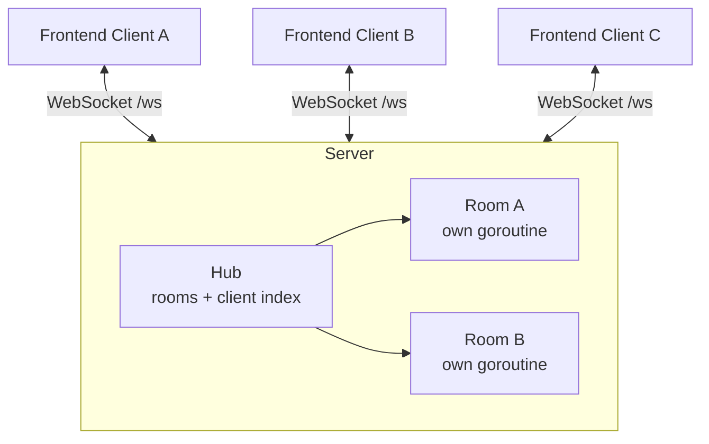

# Architecture Overview

Backlog Royale is a real-time story pointing (Scrum Poker) application: a Go backend hosts WebSocket rooms, a React frontend renders the voting experience, and every participant holds a server-authoritative snapshot of the room. This page is the entry point; the deep dives are the sibling pages.

## Design goals

- **Simplicity first:** one Go process, in-memory state, no database, no external services, no queues.
- **Frictionless joining:** a room name and a display name are all that is required. No accounts, no auth.
- **Server-authoritative behavior:** identity, vote secrecy, and role permissions are enforced on the server, never by the client.
- **Real-time UX:** every action is reflected on every connected client within one broadcast.

Each of these is backed by an Architecture Decision Record — see the [ADR index](../adr/README.md) for the full list and the trade-offs accepted along the way.

## System context



One process, one endpoint (`/ws`), no external dependencies beyond Gorilla WebSocket and `golang.org/x/time`. Rooms are created on demand when the first client joins with a given room name, and destroyed when the last one leaves.

## The pages in this section

| Page | What it covers |
| :--- | :--- |
| [Backend](backend.md) | Hub, Room, Client; state model; roles; identity and deduplication |
| [Frontend](frontend.md) | Components, hooks, connection lifecycle, theming system |
| [Concurrency model](concurrency.md) | Goroutine ownership, channel protocol, backpressure, teardown |
| [Security](security.md) | Rate limiting, vote secrecy, origin checks, and honest gaps |
| [Limitations](limitations.md) | What this design deliberately does not do, and why |

## The ten-thousand-foot data flow

1. A client opens `ws://…/ws?room=<id>&name=<name>`; the server upgrades, mints a random ID, creates-or-finds the room, and replies `WELCOME` (the ID) followed by a full `STATE` snapshot.
2. Client actions (`VOTE`, `REVEAL`, `RESET`, `TOGGLE_ROLE`, `TOGGLE_AFK`) travel as JSON over the same socket, are rate-checked, queued into the room's channel, and processed **one at a time** by the room's event-loop goroutine.
3. After every processed event, the room serializes its complete state and fan-outs it to every connected client. Hidden votes are stripped server-side until `reveal` is true.
4. Disconnects, evictions (room switches), and slow consumers all funnel through the same event loop, so membership and game state never race.

The wire format is specified in the [protocol reference](../reference/protocol.md); the guarantees and their costs are in [Concurrency model](concurrency.md).

## Component map

```text
backend/                     frontend/
├── main.go     config, middleware, server    ├── App.tsx        orchestration
├── hub.go      rooms + client index          ├── hooks/
├── room.go     state + event loop + actions  │   ├── useGameState.ts      app state
├── client.go   pumps, upgrade, rate limits   │   ├── useBacklogRoyale.ts  WS connection
├── constants.go wire constants               │   └── useTheme.ts          theming
└── room_test.go lifecycle + rules tests      ├── components/    Card, VoteSummary, …
                                              ├── utils/theme.ts vote-band colors
                                              └── index.css      semantic tokens
```

## Cross-cutting decisions at a glance

| Decision | ADR | One-line rationale |
| :--- | :--- | :--- |
| In-memory state, no persistence | [0001](../adr/0001-in-memory-state.md) | Ceremonies are short; infra simplicity wins |
| Full-state broadcasts | [0002](../adr/0002-full-state-broadcasts.md) | Self-healing clients, trivially testable |
| Server-authoritative identity | [0003](../adr/0003-server-authoritative-identity.md) | No accounts, no impersonation |
| JSON over WebSocket | [0004](../adr/0004-json-websocket-protocol.md) | Debuggability over compactness |
| Server-side vote secrecy | [0005](../adr/0005-server-side-vote-secrecy.md) | Devtools must not leak votes |
| Dealer + no-dealer fallback | [0006](../adr/0006-dealer-role-and-no-dealer-fallback.md) | Facilitation without deadlock |
| Distribution-only summary | [0007](../adr/0007-distribution-only-vote-summary.md) | Averages re-introduce anchoring |
| Eviction via room channel | [0008](../adr/0008-eviction-via-room-channel.md) | Preserves goroutine ownership |
| Semantic tokens + dark theme | [0009](../adr/0009-semantic-tokens-and-dark-theme.md) | One `.dark` block, WCAG AA |
| Automated dependency merging | [0010](../adr/0010-dependency-automation.md) | Boring maintenance, human-gated majors |
| Go version triangle | [0011](../adr/0011-go-version-triangle.md) | Toolchain drift is silent and painful |
| Git Flow | [0012](../adr/0012-git-flow.md) | Protected production, boring releases |